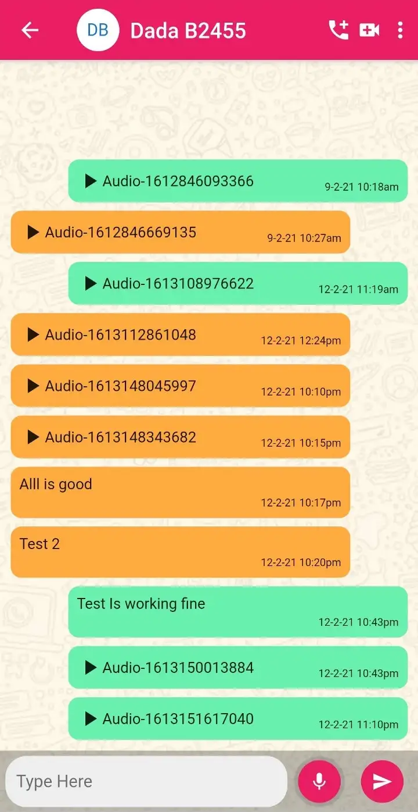
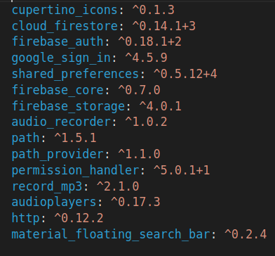

# Flutter Chat App with Voice Message

   

A few dependencies to get you started if this is your first Flutter project: 
  cloud_firestore 
  firebase_auth 
  google_sign_in 
  shared_preferences 
  firebase_core  
  firebase_storage 
  audio_recorder 
  path 
  path_provider 
  permission_handler 
  record_mp3 
  audioplayers 
  http 
  material_floating_search_bar 
  
  all packages are available on https://pub.dev/  
  
  

